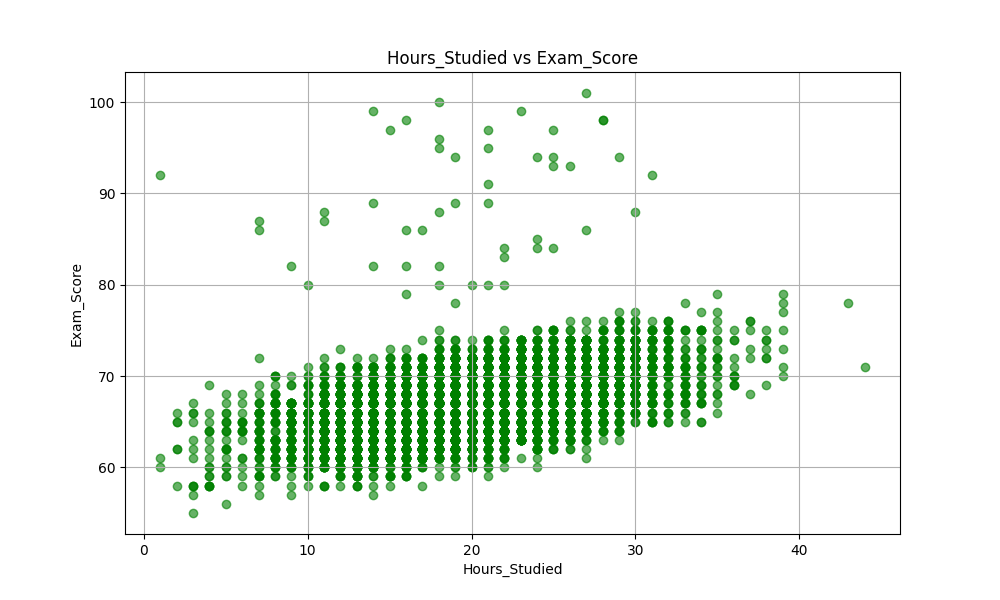
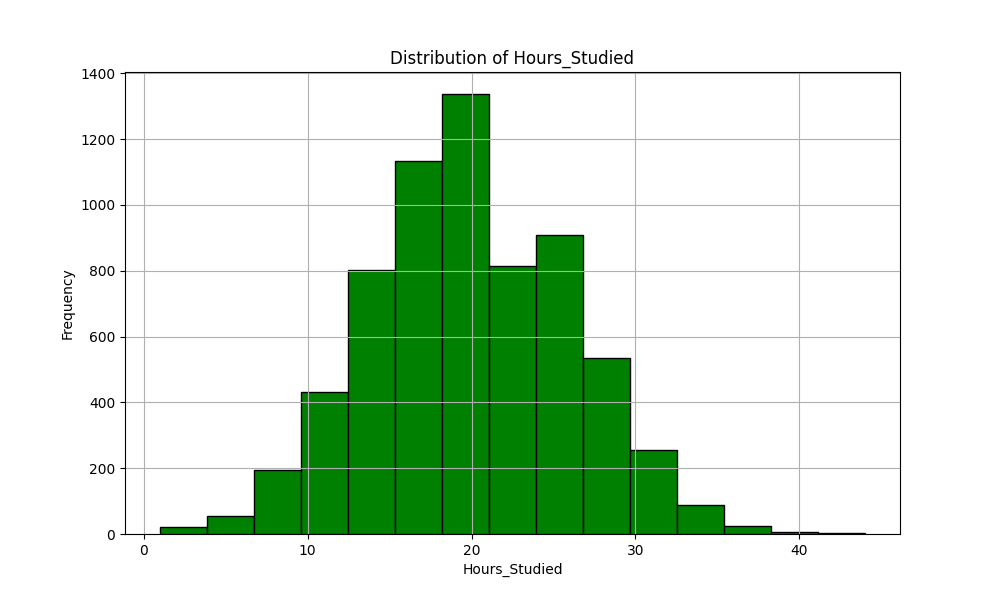
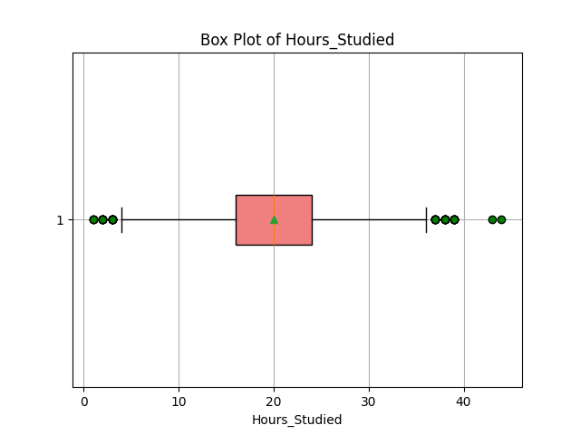
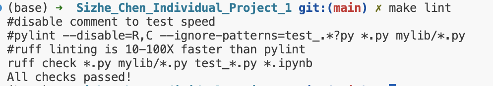
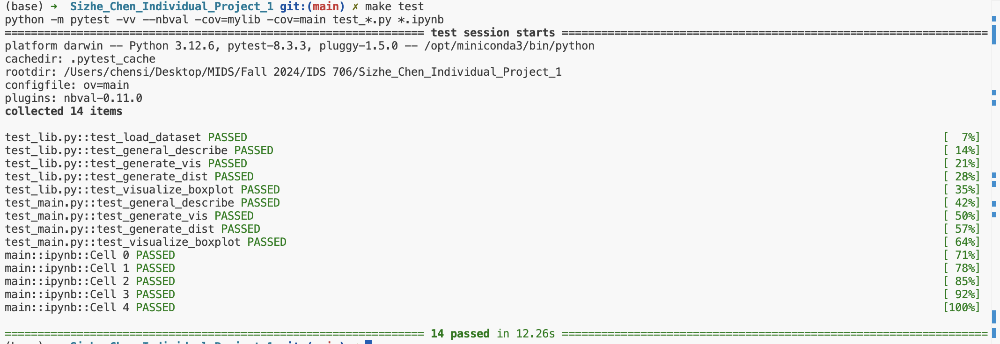

[](https://github.com/jessc0202/Sizhe_Chen_Individual_Project_1/actions/workflows/format.yml)
[](https://github.com/jessc0202/Sizhe_Chen_Individual_Project_1/actions/workflows/install.yml)
[](https://github.com/jessc0202/Sizhe_Chen_Individual_Project_1/actions/workflows/lint.yml)
[](https://github.com/jessc0202/Sizhe_Chen_Individual_Project_1/actions/workflows/test.yml)


This is my first individual project for the IDS 706:
# **Directory Tree Structure**
```text
├── Dockerfile
├── Figure_1.png
├── Figure_2.png
├── Figure_3.png
├── LICENSE
├── Makefile
├── README.md
├── StudentPerformanceFactors.csv
├── __pycache__
│   ├── main.cpython-312.pyc
│   ├── test_lib.cpython-312-pytest-8.3.3.pyc
│   └── test_main.cpython-312-pytest-8.3.3.pyc
├── directory_structure.txt
├── main.ipynb
├── main.py
├── make_lint.png
├── make_test.png
├── mylib
│   ├── __pycache__
│   │   └── lib.cpython-312.pyc
│   └── lib.py
├── repeat.sh
├── requirements.txt
├── setup.sh
├── summary_statistics.md
├── test_lib.py
└── test_main.py

# **Project Overview**
This project uses the **Students Performance Factors** dataset from Kaggle, which contains information about factors that can influence student grades. The primary goal of the project is to analyze this dataset by generating descriptive statistics and visualizations to better understand how various factors, such as **hours studied**, affect students' performance.

# **Purpose**
The purpose of this project is to **automate the generation of descriptive statistics and visualizations using Pandas**. The project involves writing Python functions to load the dataset, perform basic statistical analysis, and create plots for visual insights.

# **Main Components**
1. **Data Loading**:
   A function to load the dataset from a CSV file (`load_dataset`). This function reads the dataset from a specified file path and stores the data in a pandas DataFrame, providing the foundation for further analysis.

2. **Statistical Summaries**:
   The `general_describe` function computes and returns **descriptive statistics** for any specified column in the dataset. This includes commonly used measures such as **mean**, **median**, **minimum**, and **maximum** values, providing a high-level overview of the distribution.

3. **Visualizations**: I mainly focus on the studied hours students made and their exam scores.

- **Scatter Plot**: The `generate_vis` function creates **scatter plots** to visualize the relationship between studied hours and exam scores, allowing users to explore potential correlations.

  

- **Distribution Plot**: The `generate_dist` function generates **histograms** to display the frequency distribution of studied hours, helping to see the central tendency and spread of the data.

  

- **Box Plot**: The `visualize_boxplot` function creates **box plots** that summarize the distribution of studied hours, highlighting the **median**, **quartiles**, and **outliers**.

  

4. **Report Generation**:
   The `save_to_md` function generates a basic **markdown text file** .

# **Testing and Validation**

The **test suite** is divided between two files: `test_lib.py` and `test_main.py`, ensuring that all functions work correctly across different parts of the project. The tests include:

- **Testing Descriptive Statistics**: 
  - In `test_lib.py`, the `test_general_describe` function checks that the computed statistics for the `'Hours_Studied'` column, such as the **mean**, **median**, **standard deviation**, and **quartile ranges**, are accurate and match expected values.
  
- **Testing Data Loading and Preprocessing**: 
  - The `test_load_dataset` function in `test_lib.py` ensures that the dataset is correctly loaded and contains the required columns without being empty.
  
- **Testing Visualizations**: 
  - In `test_lib.py`, functions like `test_generate_vis`, `test_generate_dist`, and `test_visualize_boxplot` validate that visualizations (such as **scatter plots**, **histograms**, and **box plots**) are generated without errors.
  
- **Additional Functionality Testing**: 
  - `test_main.py` contains more advanced tests, including verifying that multiple descriptive statistics and visualizations are correctly combined and outputted to Markdown when required.

# **Check format and test errors**
Check Format and Test Errors

1. **Format Code**:
   To ensure that the code follows the correct formatting standards.

2. **Lint Code**:
   Linting is the process of running a program that analyzes code for potential errors and coding style issues. 
    

3. **Test Code**:
   To test the code and ensure everything is working correctly.
       


